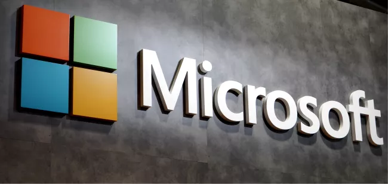
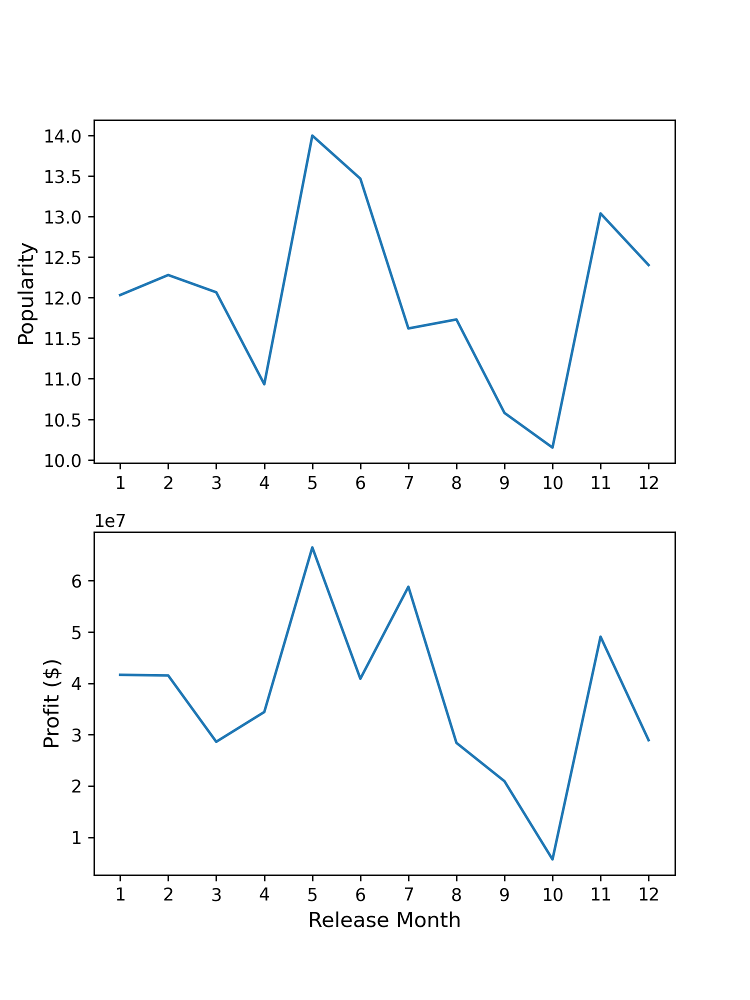
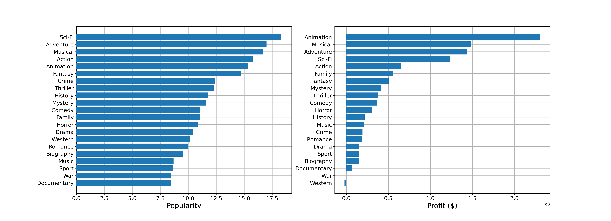
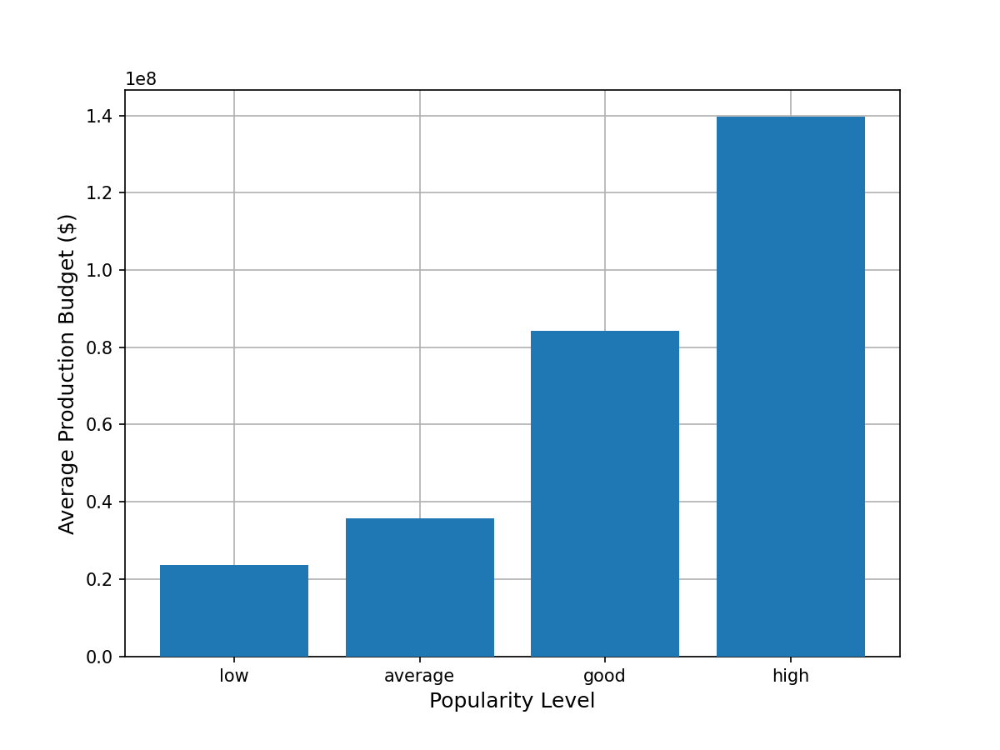

# Movie Data Analysis

# **Overview**
This project analyzes the movie genres, finance and release dates that impact the movie popularity and profit from film data collected in recent years (2010-2019). Descriptive analysis shows that animation, adventure, Sci-Fi and musical are the most popular and profitable types of movie. The analysis can help Microsoft to get into movie industry and establish a studio that produces profitable, and more importantly, popular first movie.

# **Business Values**
The movie industry has been growing rapidly and more companies create their own original contents. It is very important for the new Microsoft movie studio to invest resources on the first movie that will be popular and profitable. A successful first movie will help Microsoft to break into the movie industry and expand business peripherals. Using the movie production budget, gross, release date and popularity data, I described that genres, release dates and production budgets needs to be considered to produce a popular and profitable movie.  
# **Data Understanding**
There are several movie datasets collected from different sources. The data files provide the movie titles, their genres, finance, release dates, and popularities. The information can be merged into one dataframe by using the movie titles as key for further analysis. The datasets used for analysis are from:
- [IMDB](https://www.imdb.com/)
- [TheMovieDB](https://www.themoviedb.org/)
- [The Numbers](https://www.the-numbers.com/)
## **CSV and TSV data**
The datasets from [TheMovieDB](https://www.themoviedb.org/) and [The Numbers](https://www.the-numbers.com/) are stored in `zippedData/tmdb.movies.csv.gz` and `zippedData/tn.movie_budgets.csv.gz`
### **tmdb_movies data**
`tmdb_movies` data has move titles, popularity and release dates that range from 1930 to 2020.
### **tn_movie_budgets**
`tn_movie_budgets` data contains movie title, production_budget, gross and release dates that range from 1915 to 2020
##  **SQL data**
The datasets from [IMDB](https://www.imdb.com/) are stored in zippedData/im.db.zip and in SQL database.
# **Data Preparation**
## **Cleaning Data**
- For `tmdb_movies` data, I drop the unnecessary columns and create new column contains the release month and year of the movie and save to a new dataframe `tmdb`.
- For `tn_movie_budgets` data, I convert the money columns to integer for easier engineering and analysis. I also drop the unnecessary columns.
## **Merging Datasets**
Merge the three datasets into a single dataset for feature enginerring and analysis. I exclude the movies that were released before 2010. The analysis on recent movies gives more insigts on the film industry.
## **Feature Engineering**
Create feature `popularity_level` that represents four levels of popularity.
# **Analysis**
## **Movie Release Month**
The movie release month in a year impacts its popularity and profit. This effects is probably due to the holidays or school breaks in certain months.

##  **Movie Genres**
Certain movie genres are more popular and profitable.

## **Production Budget**
Based on genres impact analysis above, I would recommand to make a movie that includes genres in animation, adventure, musical and Sci-Fi because these genres are most popular and profitable.

The production budget to produce a movie in those genres requires further analysis.

# **Conclustion**
This analysis provides three recommandations for the first movie of Microsoft's new film studio:
- **Choose May or November to release movie.** Those two months and the following month are either school breaks or holiday seasons. Movies released on those months tend to gain high popularity and profit.
- **Produce a movie in animation, adventure, musical or Sci-Fi, or the combinations of these genres.** Movie genres have great impact on popularity and profit. Microsoft should consider make the first movie in recommended genres for high popularity and profit.
- **Invest 140 million dollars.** The high popularity movie has \\$140 million average production budget. Microsoft should consider invest \\$140 million for its first movie.
## **Next Steps:**
- Better prediction of the genres that can lead to series and peripherals
- Predict over budget outcomes.
